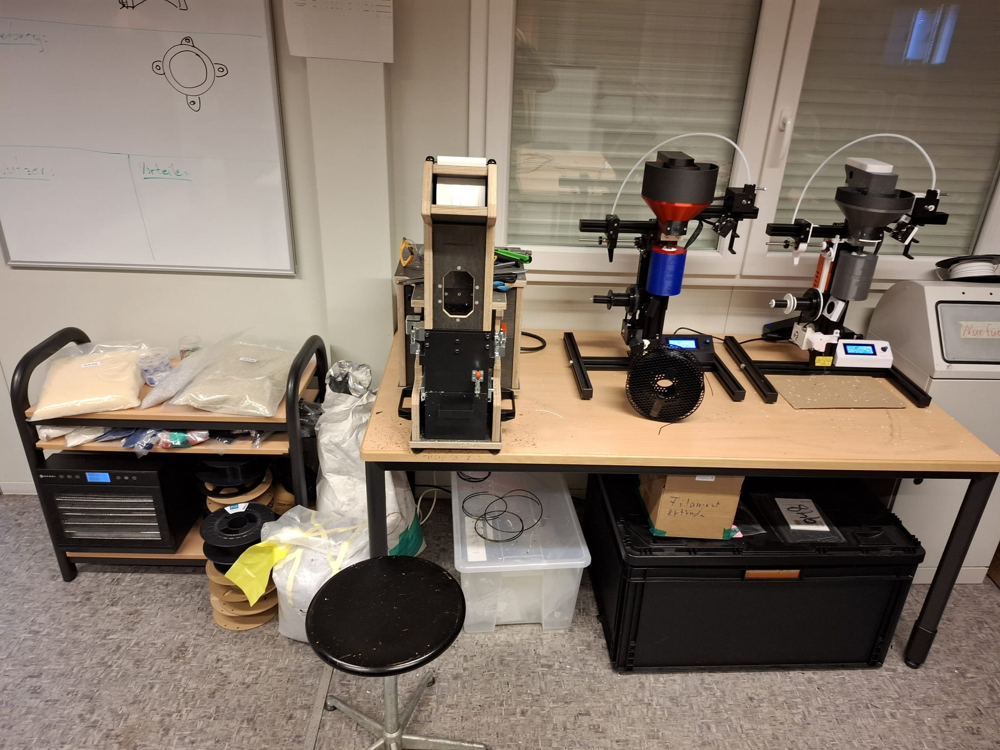

# Filament Recycling Process - Arteme3D

## Introduction
This documentation describes the filament recycling process currently established in our OpenLab at Helmut Schmidt University. It is based on two Arteme-3D MK3 Extruders. Together with a shredder and a dehydrator, it is now possible to produce recycled and new filament of industrial quality at the OpenLab.

This repository provides all the necessary information you need to work with the setup. Here, you can find extruder settings for different material compositions and basic step-by-step instructions on how to operate the machines.

I will try to update the extruder settings as often as possible so you can work with the latest and best settings for the machines.

This repository is intended to kickstart your work with the extruder setup.  
If you want to dive deeper or need to do some troubleshooting, I highly recommend checking out the [instruction manual](https://www.artme-3d.de/produkte/desktop-filament-extruder-mk3/) for the extruders on the website of Arteme-3D.

Thank you for reading! 😊

## Extrudersettings:
| No. | Material                                      | New/Old Mix | Cycle No. | P  | Temp. | Extr. rpm | Fan Speed | Tolerance Range | Rating 1–10 | Sensor Distance | Fan Distance | Fan Angle                    |
|-----|-----------------------------------------------|-------------|-----------|----|-------|------------|-----------|------------------|--------------|------------------|--------------|------------------------------|
| 1   | PLA-New                                       | 100/0       | 1         | 22 | 177   | 14         | 35        | 0.05             | 8            |                  |              |                              |
| 2   | PLA-New with 4% Blue and 2% White Masterbatch | 100/0       | 1         | 17 | 181   | 18         | 17        | 0.07             | 8            | 120              | 18           | Almost parallel, slightly off |
| 3   | PLA-New with 4% Blue and 2% White Masterbatch | 100/0       | 1         | 21 | 179   | 18         | 41        | 0.04             | 10           | 120              | 18           | Almost parallel, slightly off |
| 4   | PLA-New with 3% Black Masterbatch             | 100/0       | 1         | 27 | 185   | 14.5       | 41        | 0.05             | 8            | 240 rough        | 20           | Almost parallel, slightly off |
