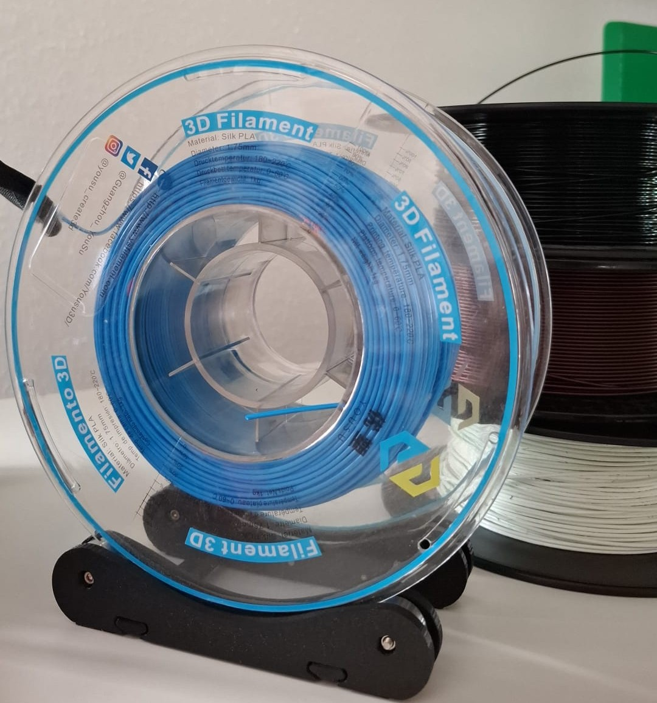
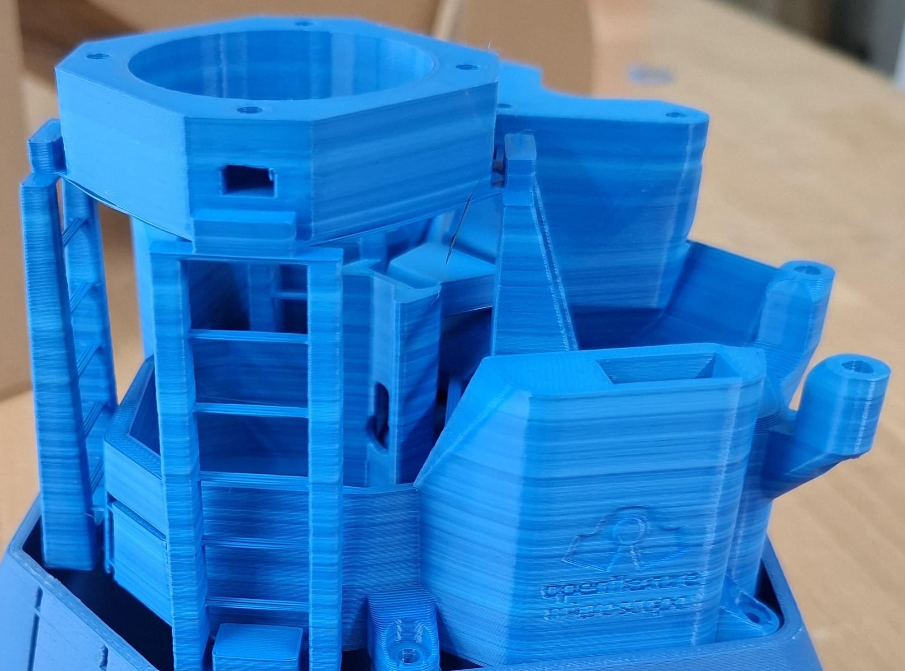

# Step-by-step guide: How to produce your first filament spool!

<blockquote style="color: red; border-left: 4px solid red; padding-left: 10px;">
If anything in this guide does not work as described or you feel unsure at any step, please do not hesitate to ask the staff around you for help!
</blockquote>

---

## 1. Preparing the extruder
Before preparing and mixing materials, installing the spool, or draining old material, begin preheating the extruder. Heating can take up to 20 minutes.

### 1.1 Power on the extruder
Plug the extruder into the nearest power outlet. It will start automatically and boot into the main info panel after a few seconds.

### 1.2 Heat the extruder
Press the knob to the right of the display to enter the main menu. Scroll down using the knob and select **"Preheat"** by pressing the knob again. The extruder will begin heating.

Once it reaches **180°C**, you’ll hear two loud buzzer sounds.

---

## 2. Preparing your material
> **Tip:** For your first spool, use **fresh PLA** instead of recycled plastic. It's much easier to work with. If you're interested in recycling, read more [here](https://www.arteme-3d.de).

### 2.1 Weighing PLA pellets
A standard spool holds about **1 kg** of plastic. Weigh out 1 kg of PLA pellets using a scale.

> **Tip:** Use a cup or bag to make weighing easier.

### 2.2 Using masterbatches (optional)
Masterbatches are color additives. You can skip them for your first spool, but if you want to add color, they’re easy to use.

> **Info:** Masterbatches (or additives) modify plastic properties, such as flexibility, color, or heat resistance. For example, Cola bottles use additives to make the plastic thin and soft. Around **3%** additive is typically enough to color PLA.

You can find mixing ratios in the [Extruder Settings Table](Extrudersettings.md). You can also combine masterbatches (e.g., red + blue = purple).

### 2.3 Weighing your masterbatch
To get 1 kg of total material, weigh ~30 g of masterbatch and 970 g of PLA pellets. Mix them thoroughly in a container.

### 2.4 Mixing materials
Mix thoroughly to avoid **color inconsistencies**. Poor mixing leads to random streaks or spots in the filament.

### 2.5 Cleaning out old material
Before adding your new mixture, remove any leftover material from the funnel:

1. Open the two screws marked with red arrows (see image).
2. Remove the plastic funnel cover.
3. Let the leftover granulate drain out into a cup or bag.
4. Use a vacuum or brush to remove any remaining particles.

### 2.6 Filling the extruder
Pour the mixed pellets into the clean funnel.  
If you're using a large quantity, attach a **funnel extension** to hold more material.

---

## 3. Setting up the extruder

### 3.1 Material change
Leftover material from the previous run needs to be purged. Start extruding—after 10 to 40 minutes, the output should be clean and consistent with your new mix.

### 3.2 Changing the spool
1. Unscrew the washer and remove the old spool.
2. Slide the new spool into place.
3. Reattach the washer and screw. Ensure the spool sits tightly and centrally.
4. Unscrew the screws of the stopblocks on (image below) and alline them with the spool, before tighteneing them again. 

### 3.3 Setting extrusion parameters
Access settings via the control wheel. Enter values from the [Extruder Settings Table](Extrudersettings.md). Scroll to a value, press the knob to edit, turn to adjust, and press again to confirm.

**Key Settings:**
+ **Extruder RPM** – Speed of extrusion.
+ **Temperature** – Heating level for melting the plastic.
+ **Fan Speed** – Controls cooling airflow over the extruded filament.

---

## 4. Starting the extrusion process

<blockquote style="color: red; border-left: 4px solid red; padding-left: 10px;">
⚠️ Before starting, remove the sensor from its holder. If left in place, it could be damaged by hot plastic!
</blockquote>

Go back to the **Main Menu** and click **Start Extruder**. The machine should begin extruding slowly.

### 4.1 Feeding into the puller
Once filament is extruding consistently (and winding into a clean spiral on the table), cut the end of the filament. Use pliers to feed it:

1. Through the guide (marked in the red oval).
2. Into the pulling unit.

### 4.2 Re-inserting the sensor
Go to the control panel. Turning the wheel changes pulling speed.

1. Reattach the sensor and place it on the filament string.
2. Adjust pulling speed by turining the knob next to the display, while you are on the infoscreen, until the sensor arm is **horizontal**.
3. Then go to the menu and select **Start Automatic Extrusion**. The extruder will now adjust speed automatically to maintain a stable diameter.

---

## 5. Calibrating filament diameter

Use digital calipers to measure the filament **just before** it enters the pulling unit. Do not stop the extrusion for this.

### If diameter is **too large** (>1.75 mm), try:
1. Lowering extruder RPM.
2. Increasing temperature slightly (+3–5°C).
3. Increasing fan speed to stabilize the sensor.
4. Lowering the sensor mount (loosen the screw, lower, then re-tighten).
5. Reducing airflow or moving the fan further from the nozzle.
6. Adding a small weight to the sensor arm (e.g., washer or nut).

### If diameter is **too small** (<1.75 mm), do the opposite.

> **Tip:** Perfect consistency is difficult. Aim for a diameter fluctuating between **1.73–1.77 mm**. A range of **1.70–1.80 mm** is still acceptable.

For detailed calibration instructions, see the [Arteme-3D calibration guide](https://www.artme-3d.de/produkte/desktop-filament-extruder-mk3/09-filament-durchmesser-kalibrieren-3/).

---

## 6. Spooling the filament

Once extrusion is stable and properly calibrated, begin spooling the filament onto the spool.

### 6.1. Fixing the filament on the spool
1. Hold the filament end against the spool and secure it with tape or by threading through the spool hole.
2. Rotate the spool manually as filament is extruded to make the first windings tight and push them to one side.

### 6.2 Monitor tension
Make sure the filament isn’t pulled too tightly or loosely. Both can affect print quality later.

### 6.3 Final steps
Once the spool is full or you’ve finished your batch:
- Cut the filament neatly.
- Tape the end down to prevent unwinding.
- Label the spool (What material is it?).

Congratulations—you've made your first filament spool! 🎉

---
